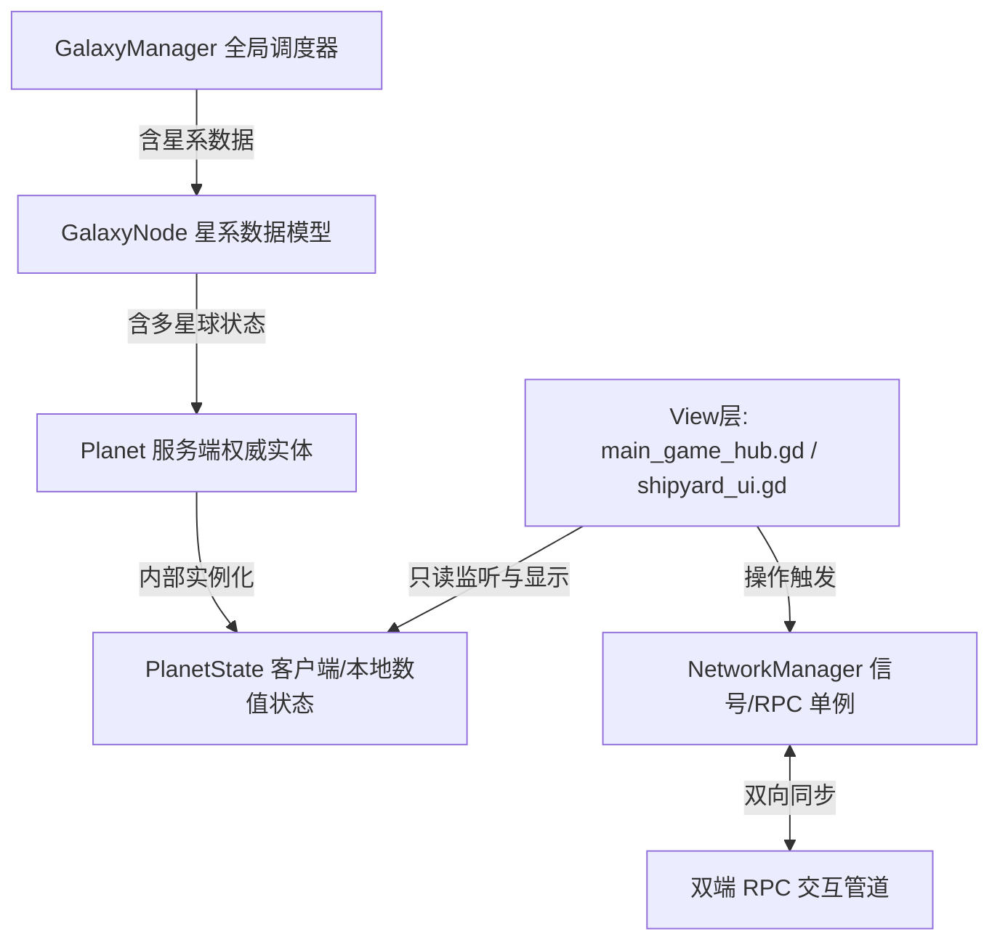

# 战略家 (Zhanlvejia) - 团队开发技术文档 (DEVELOPER.md)

欢迎加入《战略家》开发团队！本文件详细规范了多人合作开发的流程、代码架构设计、测试验证机制及部署规范，请在提交代码前仔细阅读。

---

## 1. 团队协作与 Git 开发工作流

为了维护多人在同一仓库下开发的代码稳定性，项目遵循 **Git Flow 简化版规范**。

### 1.1 分支管理规范
*   **`main` 分支 (生产分支)**：
    *   存放随时可直接打包发布的稳定代码。
    *   禁止任何开发者直接 `git push` 到 `main` 分支。
    *   合并进入 `main` 的代码必须在 `dev` 分支完成所有集成测试。
*   **`dev` 分支 (集成分支)**：
    *   所有日常开发的核心汇总分支。
    *   合并前必须保证本地 headless 自动化测试 100% 通过。
*   **`feature/*` 或 `fix/*` (个人开发分支)**：
    *   在开发新功能或修复 Bug 时，从最新 `dev` 分支拉出独立分支：
        ```bash
        git checkout dev
        git pull origin dev
        git checkout -b feature/your-feature-name
        ```
    *   完成开发自测后，发起 Merge Request / Pull Request 合并回 `dev`。

### 1.2 提交日志规范 (Conventional Commits)
每次 `git commit` 的说明必须按照以下格式书写，便于自动生成 Changelog：
*   `feat: <说明>` — 新增功能（如：`feat: 增加造船厂蓝图删除按钮`）
*   `fix: <说明>` — 修复 Bug（如：`fix: 修复星图生成崩溃`）
*   `docs: <说明>` — 仅修改文档（如：`docs: 完善资源公式备注`）
*   `style: <说明>` — 代码格式/样式重绘而不改变业务逻辑（如：`style: 主菜单毛玻璃UI美化`）
*   `test: <说明>` — 增加或修复测试用例（如：`test: 编写资源产出边界用例`）

---

## 2. 系统核心架构与数据流 (MVC)

项目采用**数据与表现分离 (MVC / Model-View-Controller)** 的核心设计理念，在多人 network 对战时由服务端行使权威（Server-Authoritative）管理。



### 2.1 核心数据模型 (Model)
所有核心数据类继承自 Godot 内置的 `Resource`，支持二进制快照打包。
*   `src/core/models/planet.gd` & `planet_state.gd`：管理星球基建、电网平衡、资源产出 Tick、升级与造船队列。
*   `src/core/models/fleet.gd`：包含战舰编队结构、当前航行 BFS 星路坐标及交火判定状态。

### 2.2 核心单例与控制类 (Controller)
*   **`GalaxyManager` (`src/core/managers/galaxy_manager.gd`)**：
    *   全局逻辑 Tick 的主要驱动者。
    *   负责管理所有星系节点所有权的变更、遭遇战的触发以及资源总表计算。
*   **`NetworkManager` (`src/core/managers/network_manager.gd`)**：
    *   联机网络底层协议封装（ENetMultiplayerPeer）。
    *   负责将全局 `GalaxyManager` 进行全量二进制序列化（`var_to_bytes_with_objects()`）并向各客户端分发快照。

### 2.3 网络同步与 RPC 逻辑安全底线
1.  **服务端权威 Tick**：
    *   只有在服务器主机（`is_server` 为 `true`）才会周期性地调用 `planet.tick(delta)` 与 `fleet.tick(delta)`。
    *   客户端本地的逻辑 Tick 均属于表现层模拟，以快照下发的数据为准。
2.  **RPC 校验阀门**：
    *   客户端通过 `@rpc("any_peer", "call_local")` 发起写操作（如 `server_request_upgrade_building`）。
    *   服务端接包后，必须首先通过 `multiplayer.get_remote_sender_id()` 校验发送者是否为该星球的拥有者，并核对库存储备，严防资源超支。

---

## 3. 自动化集成测试与自检规范

所有开发者在准备合并代码至 `dev` 分支前，**必须执行且跑通全部 Headless 测试套件**。

### 3.1 自动化测试文件分布 (`scratch/`)
*   `scratch/test_resource_integration.gd`：包含 **82 项** 核心资源 Tick 产生、公式能效、双端 RPC 扣费及造船流程用例。
*   `scratch/test_adversarial_1.gd`：包含 **17 项** 针对整数溢出、恶意节点注入及非法路径跳转的安全边界验证。
*   `scratch/test_adversarial_2.gd`：包含 **15 项** 针对死锁卡死、重复进入房间网络泄漏等的防错验证。

### 3.2 本地运行自测命令
测试可以在命令行模式下以 headless 方式极速运行，请确保指向您的 Godot 引擎可执行程序路径：
```bash
# 运行资源计算集成测试
"D:/安装文件/开发工具/Godot_v4.7-stable_win64.exe/Godot_v4.7-stable_win64.exe" --headless -s res://scratch/test_resource_integration.gd

# 运行边界与对抗性防错测试
"D:/安装文件/开发工具/Godot_v4.7-stable_win64.exe/Godot_v4.7-stable_win64.exe" --headless -s res://scratch/test_adversarial_1.gd
```
测试如果通过，终端应当输出包含 `TEST SUMMARY: All tests passed successfully!` 的日志，且以 **Exit Code: 0** 退出。如果退出码非 0，则说明测试存在断言失败，严禁提交或合并分支！

---

## 4. 远程发布与服务端部署指南

多人对战需要无头（Headless）服务端常驻后台运行，项目提供了自动化部署机制。

### 4.1 自动一键编译与分发
1.  **打包 Windows 客户端**：
    *   在本地运行 `py compile_and_copy_client.py`，脚本将自动读取 Godot 导出配置，生成发布目录的客户端独立执行程序。
2.  **自动化 Linux 部署**：
    *   本地配置好服务器 SSH Key 后，执行 `py deploy_server.py`。
    *   脚本将自动打包 `zhanlvejia.pck` 并远程上载至 Linux 生产主机，自动重启远程 Systemd 守护进程。

### 4.2 Linux 常驻服务配置档 (`systemd`)
服务端 Linux 主机的 Systemd 配置文件位于 `/etc/systemd/system/zhanlvejia-server.service`。模板如下：
```ini
[Unit]
Description=Zhanlvejia Headless Game Server
After=network.target

[Service]
Type=simple
WorkingDirectory=/root/zhanlvejia
ExecStart=/root/zhanlvejia/Godot_v4.7-stable_linux.x86_64 --headless --main-pack zhanlvejia.pck
Restart=always
RestartSec=5
User=root

[Install]
WantedBy=multi-user.target
```
*   **常用运维指令**：
    *   查看服务器战报与联机日志：`journalctl -u zhanlvejia-server.service -n 100 -f`
    *   重启服务：`systemctl restart zhanlvejia-server.service`
