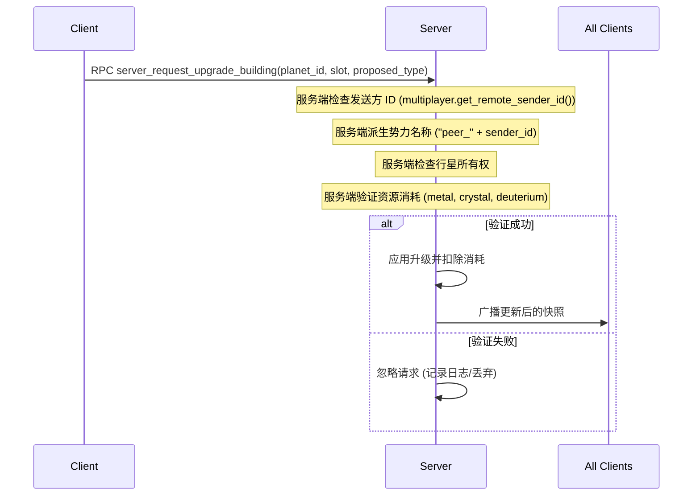

# 功能：多人游戏与服务端权威同步

## 1. 说明与用户流程 (Description & User Flow)
**多人游戏与服务端权威同步**系统支持基于 ENet 的网络大厅、房间、准备就绪检查以及服务端状态同步。中央服务器管理 P2E 和 P2P 大厅。各势力通过 RPC 命令进行操作，这些命令在服务端进行验证。服务端维护主状态，并使用二进制快照将其复制到客户端。

### 用户流程：
1. **大厅连接**：玩家从主菜单选择“多人游戏”，选择一个名称，然后连接到位于 `8.215.89.194:9999` 的大厅服务器。
2. **房间管理**：
   - 玩家可以创建一个受密码保护的房间或加入一个现有房间。
   - 房间面板显示玩家列表及其准备就绪状态。
   - 一旦所有玩家都准备就绪，房主可以点击**开始游戏**。
3. **游戏同步**：
   - 服务端生成地图并将初始快照发送给所有玩家，分配一个初始母星系。
   - 在游戏过程中，客户端通过 RPC 向服务端发送请求（例如建筑升级、舰船建造或舰队移动）。
   - 服务端验证并处理这些操作，并广播快照更新以保持客户端同步。
4. **连接生命周期**：如果玩家断开连接，他们拥有的星系将恢复为中立状态，他们的舰队将被移除，并且其他玩家会收到通知。

---

## 2. 架构与代码入口 (Architecture & Code Entry Points)
网络管理、RPC 命令和房间状态同步集中在以下文件中：

- **控制器/管理器 (Controller/Manager)**：
  - `src/core/managers/network_manager.gd`：自动加载的单例，管理 ENet 网络对等端 (peers)、大厅、房间、状态复制和 RPC 验证。
- **UI 场景/脚本 (UI Scenes/Scripts)**：
  - `src/ui/network_lobby.tscn` / `src/ui/network_lobby.gd`：用于创建房间、输入密码、准备就绪检查和大厅列表的 UI 布局。

---

## 3. 技术设计与算法 (Technical Design & Algorithms)

### 网络设置与 ENet 接口 (Network Setup & ENet Interface)
网络通信建立在 Godot 的 `ENetMultiplayerPeer` 类之上。
* **托管服务**：服务端使用 `create_server(port, max_clients)` 绑定到端口 `9999`。
* **进行连接**：客户端使用 `create_client(ip, port)` 连接到服务端。

### 服务端权威刻度与快照复制 (Server Authoritative Tick & Snapshot Replication)
服务端运行游戏逻辑并使用二进制快照将状态复制到客户端：
1. **服务端刻度 (Server Tick)**：
   - 在 `_process(delta)` 中，服务端对活跃游戏的星系状态进行刻度计算 (tick)：
     ```gdscript
     room["galaxy_manager"].tick(delta)
     ```
2. **复制间隔**：每 5.0 秒，服务端向房间内的所有客户端广播状态更新。
3. **复制过程**：
   - **序列化**：服务端将 `GalaxyManager` 资源序列化为二进制数组：
     ```gdscript
     var snapshot_bytes = var_to_bytes_with_objects(galaxy_manager)
     ```
   - **传输**：服务端通过 RPC 调用将二进制快照发送给客户端：
     ```gdscript
     rpc_id(peer_id, "client_receive_universe_update", snapshot_bytes)
     ```
   - **反序列化**：客户端接收快照并重建其本地状态：
     ```gdscript
     galaxy_manager = bytes_to_var_with_objects(snapshot_bytes) as GalaxyManager
     galaxy_manager.reconnect_signals()
     ```

---

### RPC 接口与验证逻辑 (RPC Interface & Validation Logic)

当客户端执行操作时，它会向服务端发送 RPC 请求。服务端在更新游戏状态之前验证该请求：



#### RPC 端点与验证规则：

1. **建筑升级 (Building Upgrades)**：
   `server_request_upgrade_building(planet_id: String, slot_index: int, proposed_type: String)`
   * *验证*：验证发送方是否拥有该行星、槽位索引是否有效（$0 \le \text{slot} \le 9$）、槽位是否为空或与升级类型匹配、建筑等级是否在 20 以下，以及玩家是否有足够的资源。

2. **舰船建造 (Ship Construction)**：
   `server_request_ship_construction_with_design(planet_id: String, design_name: String, quantity: int, design_dict: Dictionary)`
   * *验证*：验证发送方是否拥有该行星、舰船设计参数是否有效、数量是否为正数、星系中是否包含活跃的造船厂，以及玩家是否有足够的资源。

3. **拆除建筑 (Demolishing Buildings)**：
   `server_request_demolish_building(planet_id: String, slot_index: int)`
   * *验证*：验证发送方是否拥有该行星，且槽位未处于活跃的升级队列中。如果造船厂有活跃的舰船建造订单，则阻止拆除。

4. **组建舰队 (Fleet Formation)**：
   `server_request_form_fleet(planet_id: String, fleet_name: String, ships_dict: Dictionary)`
   * *验证*：验证发送方是否拥有该行星、舰船数量是否为正数，以及舰船在星系机库中是否可用。

5. **派遣舰队 (Fleet Dispatch)**：
   `server_request_dispatch_fleet(fleet_name: String, origin_node_id: String, target_node_id: String)`
   * *验证*：验证发送方是否拥有该舰队，以及到达目的地的路径是否有效。如果路径穿过敌对系统（攻击订单除向外），则移动会被阻止。

---

## 4. 开发状态 (Development Status)
- **当前状态**：已完成。
- **最近更新**：实现了房间列表、密码验证和准备就绪条件。处理了断开连接后的清理工作（断开连接玩家的星系恢复为中立，其舰队被擦除）。
- **已知问题 / 技术债务**：对于 100 个星系的地图，每 5 秒通过 `var_to_bytes_with_objects` 广播一次完整的星系管理器状态会非常消耗带宽。应优化为增量更新 (delta updates) 或属性同步。
