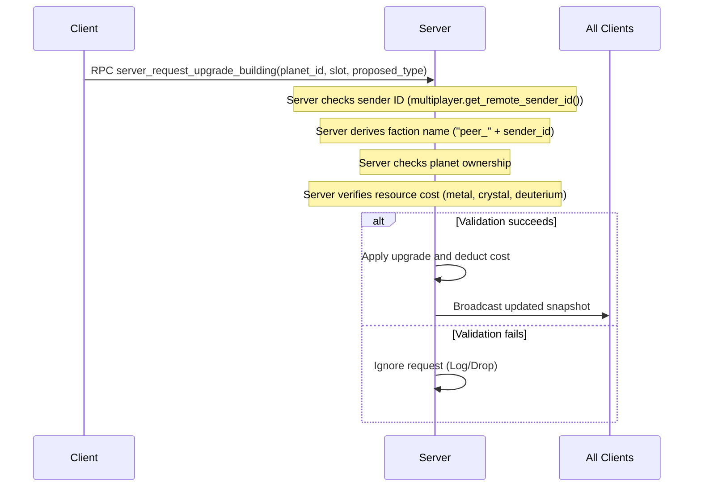

# Feature: Multiplayer & Server-Authoritative Sync

## 1. Description & User Flow
The **Multiplayer & Server-Authoritative Sync** system supports ENet-based network lobbies, rooms, readiness checks, and server-side state synchronization. A central server manages P2E and P2P lobbies. Factions act via RPC commands, which are validated server-side. The server maintains the master state and replicates it to clients using binary snapshots.

### User Flow:
1. **Lobby Connection**: Players select "Multiplayer" from the main menu, choose a name, and connect to the lobby server at `8.215.89.194:9999`.
2. **Room Management**:
   - Players can create a password-protected room or join an existing room.
   - The room panel displays the list of players and their readiness status.
   - The host can click **Start Game** once all players are ready.
3. **Gameplay Synchronization**:
   - The server generates the map and sends the initial snapshot to all players, allocating a starting home system.
   - While playing, clients send requests (such as building upgrades, ship construction, or fleet movements) to the server via RPCs.
   - The server validates and processes the actions, and broadcasts snapshot updates to keep clients synchronized.
4. **Connection Lifecycle**: If a player disconnects, their owned systems revert to neutral status, their fleets are removed, and the remaining players are notified.

---

## 2. Architecture & Code Entry Points
Network management, RPC commands, and room state synchronization are centralized in these files:

- **Controller/Manager**:
  - `src/core/managers/network_manager.gd`: Autoload singleton managing ENet network peers, lobbies, rooms, state replication, and RPC validation.
- **UI Scenes/Scripts**:
  - `src/ui/network_lobby.tscn` / `src/ui/network_lobby.gd`: UI layout for room creation, password entry, readiness checks, and lobby lists.

---

## 3. Technical Design & Algorithms

### Network Setup & ENet Interface
Network communication is built on Godot's `ENetMultiplayerPeer` class.
* **Hosting**: The server binds to port `9999` using `create_server(port, max_clients)`.
* **Connecting**: Clients connect to the server using `create_client(ip, port)`.

### Server Authoritative Tick & Snapshot Replication
The server runs gameplay logic and replicates state to clients using binary snapshots:
1. **Server Tick**:
   - In `_process(delta)`, the server ticks the galaxy state for active games:
     ```gdscript
     room["galaxy_manager"].tick(delta)
     ```
2. **Replication Interval**: Every 5.0 seconds, the server broadcasts state updates to all clients in the room.
3. **Replication Process**:
   - **Serialization**: The server serializes the `GalaxyManager` resource into a binary array:
     ```gdscript
     var snapshot_bytes = var_to_bytes_with_objects(galaxy_manager)
     ```
   - **Transmission**: The server sends the binary snapshot to clients via an RPC call:
     ```gdscript
     rpc_id(peer_id, "client_receive_universe_update", snapshot_bytes)
     ```
   - **Deserialization**: Clients receive the snapshot and rebuild their local state:
     ```gdscript
     galaxy_manager = bytes_to_var_with_objects(snapshot_bytes) as GalaxyManager
     galaxy_manager.reconnect_signals()
     ```

---

### RPC Interface & Validation Logic

When a client performs an action, it sends an RPC request to the server. The server validates the request before updating the game state:



#### RPC Endpoints & Validation Rules:

1. **Building Upgrades**:
   `server_request_upgrade_building(planet_id: String, slot_index: int, proposed_type: String)`
   * *Validation*: Verifies that the sender owns the planet, the slot index is valid ($0 \le \text{slot} \le 9$), the slot is empty or matches the upgrade type, the building level is under 20, and the player has enough resources.

2. **Ship Construction**:
   `server_request_ship_construction_with_design(planet_id: String, design_name: String, quantity: int, design_dict: Dictionary)`
   * *Validation*: Verifies that the sender owns the planet, the ship design parameters are valid, the quantity is positive, the system contains an active shipyard, and the player has enough resources.

3. **Demolishing Buildings**:
   `server_request_demolish_building(planet_id: String, slot_index: int)`
   * *Validation*: Verifies that the sender owns the planet, and the slot is not in the active upgrade queue. Demolishing a shipyard is blocked if it has active ship construction orders.

4. **Fleet Formation**:
   `server_request_form_fleet(planet_id: String, fleet_name: String, ships_dict: Dictionary)`
   * *Validation*: Verifies that the sender owns the planet, the ship quantities are positive, and the ships are available in the system's hangars.

5. **Fleet Dispatch**:
   `server_request_dispatch_fleet(fleet_name: String, origin_node_id: String, target_node_id: String)`
   * *Validation*: Verifies that the sender owns the fleet, and the path to the destination is valid. Movement is blocked if it passes through hostile systems (except for attack orders).

---

## 4. Development Status
- **Current Status**: Completed.
- **Recent Updates**: Implemented room listings, password verification, and readiness conditions. Handled disconnect cleanup (disconnected players' systems revert to Neutral, and their fleets are erased).
- **Known Issues / Tech Debts**: Broadcasting the full galaxy manager state via `var_to_bytes_with_objects` every 5 seconds is bandwith-heavy for 100-system maps. Should be optimized to delta updates or property sync.
